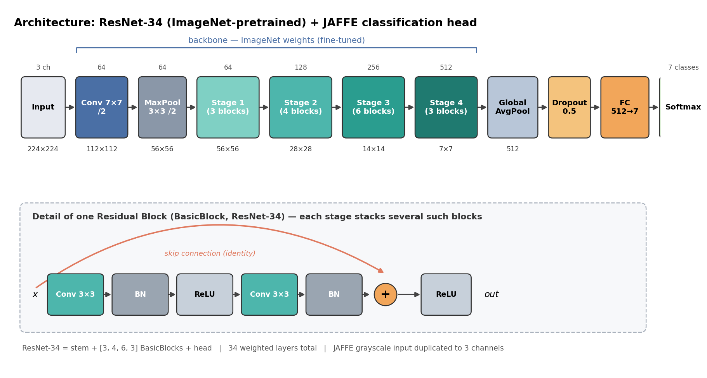
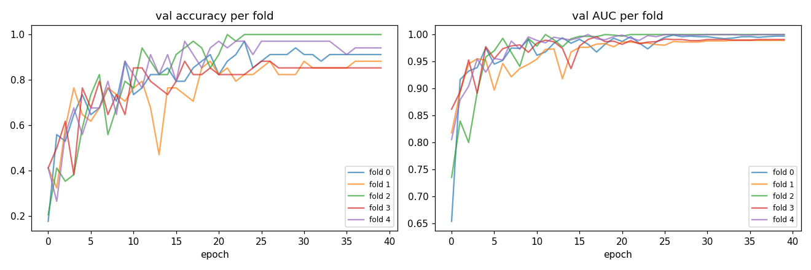
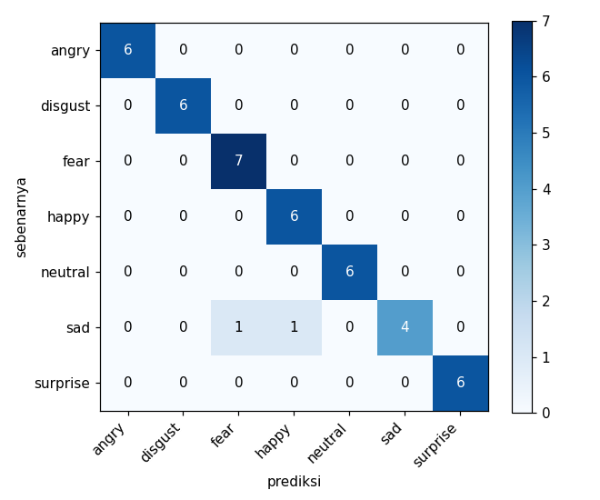
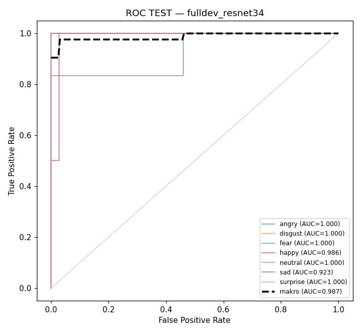

# Laporan Klasifikasi Ekspresi Wajah JAFFE (7 kelas)

Dibuat otomatis dari `jaffee/experiments/cv_resnet34/`. Regenerasi: `python jaffee/src/make_laporan.py`

## 1. Arsitektur Model

Model = **ResNet-34** (pra-terlatih ImageNet) sebagai pengekstrak fitur, diikuti kepala klasifikasi ringan. Ini analog 2D dari pemenang CASME II (r3d_18 pra-terlatih Kinetics); JAFFE gambar diam, jadi backbone temporal 3D tidak dipakai.

| bagian | detail |
|---|---|
| Input | gambar grayscale JAFFE → 3 channel, 240×240 → crop 224×224 |
| Backbone | ResNet-34, bobot ImageNet (Conv0 + 4 stage: 64/128/256/512) |
| Pooling | Global Average Pooling → 512 fitur |
| Head | Dropout 0.5 → Linear 512→7 → Softmax |
| Jumlah kelas | 7 (angry, disgust, fear, happy, neutral, sad, surprise) |

## 2. Skenario Eksperimen

| aspek | nilai |
|---|---|
| Dataset | JAFFE, 213 gambar, 10 subjek, 7 kelas |
| Split | TEST 43 (dikunci) + DEV 170 |
| Cross-validation | 5-fold stratified pada DEV (~136 latih / ~34 validasi per fold) |
| Validasi | tiap epoch tiap fold (loss, accuracy, AUC) |
| Testing | sekali, ensemble 5 model fold |
| Backbone | resnet34 (pretrained=True) |
| Epoch | 40 | 
| Optimizer | AdamW, lr=0.0003, weight_decay=0.0001 |
| Scheduler | Cosine annealing |
| Loss | Cross-entropy, label smoothing 0.05 |
| Augmentasi | flip, rotasi ±12°, brightness ±0.2, random-erase 0.25 |
| TTA | 4 view deterministik |
| Batch size | 16 |
| Seed | 42 |

## 3. Hasil Training & Validasi (tiap epoch, tiap fold)

Kurva ringkas (accuracy & AUC validasi tiap fold): `experiments/cv_resnet34/cv_val_curve.png`

### Fold 0

| epoch | train_loss | train_acc | val_loss | val_acc | val_AUC |
|---|---|---|---|---|---|
| 0 | 2,0986 | 0,2574 | 2,3917 | 0,1765 | 0,6540 |
| 1 | 1,5378 | 0,4559 | 1,2673 | 0,5588 | 0,9166 |
| 2 | 1,1774 | 0,6471 | 1,0624 | 0,5294 | 0,9323 |
| 3 | 1,1030 | 0,5956 | 0,9934 | 0,6471 | 0,9387 |
| 4 | 0,8580 | 0,7794 | 0,7010 | 0,7353 | 0,9753 |
| 5 | 0,7446 | 0,7794 | 0,9072 | 0,6471 | 0,9452 |
| 6 | 0,7072 | 0,8235 | 0,9603 | 0,6765 | 0,9521 |
| 7 | 0,6644 | 0,8603 | 0,6251 | 0,7647 | 0,9750 |
| 8 | 0,4834 | 0,9412 | 0,9143 | 0,7059 | 0,9744 |
| 9 | 0,7027 | 0,8309 | 0,3855 | 0,8824 | 0,9911 |
| 10 | 0,5889 | 0,8750 | 0,7958 | 0,7353 | 0,9616 |
| 11 | 0,5417 | 0,8897 | 0,7041 | 0,7647 | 0,9676 |
| 12 | 0,4633 | 0,9191 | 0,6350 | 0,8235 | 0,9840 |
| 13 | 0,5006 | 0,9191 | 0,3476 | 0,8235 | 0,9939 |
| 14 | 0,4585 | 0,9338 | 0,4425 | 0,8529 | 0,9838 |
| 15 | 0,4478 | 0,9485 | 0,6702 | 0,7941 | 0,9911 |
| 16 | 0,3942 | 0,9632 | 0,6800 | 0,7941 | 0,9821 |
| 17 | 0,5081 | 0,9118 | 0,6222 | 0,8529 | 0,9676 |
| 18 | 0,4659 | 0,9338 | 0,4957 | 0,8824 | 0,9821 |
| 19 | 0,3476 | 0,9853 | 0,2734 | 0,9118 | 0,9931 |
| 20 | 0,3688 | 0,9779 | 0,5412 | 0,8235 | 0,9872 |
| 21 | 0,4180 | 0,9412 | 0,3066 | 0,8824 | 0,9961 |
| 22 | 0,3482 | 0,9853 | 0,3145 | 0,9118 | 0,9842 |
| 23 | 0,3468 | 0,9853 | 0,3535 | 0,9706 | 0,9734 |
| 24 | 0,3433 | 0,9779 | 0,4536 | 0,8529 | 0,9864 |
| 25 | 0,3336 | 0,9926 | 0,2664 | 0,8824 | 0,9949 |
| 26 | 0,3226 | 1,0000 | 0,2684 | 0,9118 | 0,9990 |
| 27 | 0,4001 | 0,9706 | 0,2454 | 0,9118 | 0,9961 |
| 28 | 0,4024 | 0,9559 | 0,2658 | 0,9118 | 0,9970 |
| 29 | 0,3315 | 0,9779 | 0,2459 | 0,9412 | 0,9961 |
| 30 | 0,3833 | 0,9706 | 0,2604 | 0,9118 | 0,9961 |
| 31 | 0,4121 | 0,9485 | 0,2805 | 0,9118 | 0,9939 |
| 32 | 0,3033 | 1,0000 | 0,3038 | 0,8824 | 0,9923 |
| 33 | 0,3161 | 0,9926 | 0,3011 | 0,9118 | 0,9935 |
| 34 | 0,3562 | 0,9779 | 0,2959 | 0,9118 | 0,9959 |
| 35 | 0,3391 | 0,9779 | 0,2977 | 0,9118 | 0,9961 |
| 36 | 0,3067 | 1,0000 | 0,2931 | 0,9118 | 0,9949 |
| 37 | 0,3157 | 1,0000 | 0,2905 | 0,9118 | 0,9961 |
| 38 | 0,3402 | 0,9706 | 0,2940 | 0,9118 | 0,9970 |
| 39 | 0,3389 | 0,9779 | 0,2905 | 0,9118 | 0,9970 |

### Fold 1

| epoch | train_loss | train_acc | val_loss | val_acc | val_AUC |
|---|---|---|---|---|---|
| 0 | 2,1857 | 0,1912 | 1,6529 | 0,4118 | 0,8179 |
| 1 | 1,5494 | 0,4191 | 1,7030 | 0,3235 | 0,8940 |
| 2 | 1,1183 | 0,6029 | 0,9648 | 0,5882 | 0,9456 |
| 3 | 0,9577 | 0,7206 | 0,6733 | 0,7647 | 0,9550 |
| 4 | 0,8089 | 0,7794 | 0,9541 | 0,6471 | 0,9527 |
| 5 | 0,8154 | 0,7941 | 1,7210 | 0,6176 | 0,8971 |
| 6 | 0,7526 | 0,8309 | 0,9453 | 0,6765 | 0,9464 |
| 7 | 0,8729 | 0,7721 | 1,0613 | 0,7647 | 0,9218 |
| 8 | 0,5805 | 0,8824 | 0,9337 | 0,7353 | 0,9369 |
| 9 | 0,6105 | 0,8897 | 0,9040 | 0,7059 | 0,9448 |
| 10 | 0,4668 | 0,9191 | 0,8174 | 0,7647 | 0,9545 |
| 11 | 0,6172 | 0,8897 | 0,7027 | 0,7941 | 0,9724 |
| 12 | 0,5095 | 0,9118 | 0,7826 | 0,6765 | 0,9734 |
| 13 | 0,4439 | 0,9485 | 1,3427 | 0,4706 | 0,9180 |
| 14 | 0,4316 | 0,9338 | 0,8308 | 0,7647 | 0,9675 |
| 15 | 0,5009 | 0,9412 | 0,6510 | 0,7647 | 0,9764 |
| 16 | 0,4398 | 0,9412 | 0,9201 | 0,7353 | 0,9764 |
| 17 | 0,4972 | 0,9412 | 0,7199 | 0,7059 | 0,9823 |
| 18 | 0,4308 | 0,9412 | 0,5493 | 0,8529 | 0,9833 |
| 19 | 0,4118 | 0,9706 | 0,5580 | 0,8824 | 0,9773 |
| 20 | 0,3751 | 0,9632 | 0,5256 | 0,8235 | 0,9862 |
| 21 | 0,4792 | 0,9412 | 0,6553 | 0,8529 | 0,9862 |
| 22 | 0,4224 | 0,9485 | 0,5852 | 0,7941 | 0,9842 |
| 23 | 0,3473 | 0,9853 | 0,5445 | 0,8235 | 0,9842 |
| 24 | 0,4112 | 0,9485 | 0,4433 | 0,8235 | 0,9813 |
| 25 | 0,3917 | 0,9779 | 0,4518 | 0,8529 | 0,9803 |
| 26 | 0,3171 | 0,9926 | 0,4162 | 0,8824 | 0,9872 |
| 27 | 0,3273 | 0,9926 | 0,4623 | 0,8235 | 0,9862 |
| 28 | 0,3421 | 0,9853 | 0,4486 | 0,8235 | 0,9862 |
| 29 | 0,3238 | 0,9926 | 0,4030 | 0,8235 | 0,9862 |
| 30 | 0,3356 | 0,9779 | 0,3859 | 0,8824 | 0,9882 |
| 31 | 0,3196 | 1,0000 | 0,3941 | 0,8529 | 0,9882 |
| 32 | 0,3630 | 0,9706 | 0,3901 | 0,8529 | 0,9882 |
| 33 | 0,3229 | 0,9926 | 0,3736 | 0,8529 | 0,9892 |
| 34 | 0,3178 | 0,9926 | 0,3914 | 0,8529 | 0,9892 |
| 35 | 0,3724 | 0,9706 | 0,3962 | 0,8529 | 0,9892 |
| 36 | 0,3055 | 1,0000 | 0,3762 | 0,8824 | 0,9892 |
| 37 | 0,3095 | 0,9926 | 0,3786 | 0,8824 | 0,9892 |
| 38 | 0,3225 | 0,9926 | 0,3665 | 0,8824 | 0,9892 |
| 39 | 0,3067 | 1,0000 | 0,3720 | 0,8824 | 0,9892 |

### Fold 2

| epoch | train_loss | train_acc | val_loss | val_acc | val_AUC |
|---|---|---|---|---|---|
| 0 | 2,0736 | 0,1618 | 3,1798 | 0,2059 | 0,7353 |
| 1 | 1,4751 | 0,4632 | 2,9311 | 0,4118 | 0,8399 |
| 2 | 1,2310 | 0,5515 | 3,0503 | 0,3529 | 0,8000 |
| 3 | 1,0430 | 0,6397 | 2,0652 | 0,3824 | 0,8927 |
| 4 | 0,9731 | 0,6544 | 1,0081 | 0,5882 | 0,9584 |
| 5 | 0,8076 | 0,7868 | 0,7801 | 0,7353 | 0,9698 |
| 6 | 0,7618 | 0,7647 | 0,4520 | 0,8235 | 0,9931 |
| 7 | 0,6521 | 0,8456 | 1,6272 | 0,5588 | 0,9669 |
| 8 | 0,6165 | 0,8676 | 1,1622 | 0,6765 | 0,9408 |
| 9 | 0,6324 | 0,8750 | 0,4063 | 0,7941 | 0,9927 |
| 10 | 0,6574 | 0,8456 | 0,6841 | 0,7647 | 0,9787 |
| 11 | 0,6512 | 0,8382 | 0,1845 | 0,9412 | 1,0000 |
| 12 | 0,6437 | 0,8456 | 0,4182 | 0,8824 | 0,9903 |
| 13 | 0,6023 | 0,8676 | 0,5135 | 0,8235 | 0,9771 |
| 14 | 0,5198 | 0,9191 | 0,4235 | 0,8235 | 0,9921 |
| 15 | 0,5004 | 0,9265 | 0,2991 | 0,9118 | 0,9966 |
| 16 | 0,5364 | 0,9044 | 0,2070 | 0,9412 | 0,9966 |
| 17 | 0,5170 | 0,9044 | 0,2014 | 0,9706 | 0,9961 |
| 18 | 0,4837 | 0,9044 | 0,1929 | 0,9412 | 1,0000 |
| 19 | 0,5039 | 0,9118 | 0,4227 | 0,8529 | 0,9990 |
| 20 | 0,3867 | 0,9779 | 0,2848 | 0,9118 | 0,9970 |
| 21 | 0,4302 | 0,9412 | 0,0942 | 1,0000 | 1,0000 |
| 22 | 0,3704 | 0,9779 | 0,0849 | 0,9706 | 1,0000 |
| 23 | 0,3617 | 0,9706 | 0,0899 | 1,0000 | 1,0000 |
| 24 | 0,3534 | 0,9926 | 0,0586 | 1,0000 | 1,0000 |
| 25 | 0,3349 | 0,9926 | 0,0782 | 1,0000 | 1,0000 |
| 26 | 0,3688 | 0,9706 | 0,0774 | 1,0000 | 1,0000 |
| 27 | 0,3323 | 0,9853 | 0,0678 | 1,0000 | 1,0000 |
| 28 | 0,3276 | 0,9926 | 0,0726 | 1,0000 | 1,0000 |
| 29 | 0,3250 | 0,9926 | 0,0615 | 1,0000 | 1,0000 |
| 30 | 0,3602 | 0,9853 | 0,0553 | 1,0000 | 1,0000 |
| 31 | 0,3297 | 0,9926 | 0,0525 | 1,0000 | 1,0000 |
| 32 | 0,3458 | 0,9853 | 0,0495 | 1,0000 | 1,0000 |
| 33 | 0,3488 | 0,9779 | 0,0476 | 1,0000 | 1,0000 |
| 34 | 0,3045 | 1,0000 | 0,0474 | 1,0000 | 1,0000 |
| 35 | 0,3380 | 0,9853 | 0,0480 | 1,0000 | 1,0000 |
| 36 | 0,3168 | 1,0000 | 0,0501 | 1,0000 | 1,0000 |
| 37 | 0,3320 | 0,9853 | 0,0463 | 1,0000 | 1,0000 |
| 38 | 0,3143 | 1,0000 | 0,0485 | 1,0000 | 1,0000 |
| 39 | 0,3858 | 0,9632 | 0,0463 | 1,0000 | 1,0000 |

### Fold 3

| epoch | train_loss | train_acc | val_loss | val_acc | val_AUC |
|---|---|---|---|---|---|
| 0 | 1,9880 | 0,2500 | 1,4568 | 0,4118 | 0,8618 |
| 1 | 1,3520 | 0,5515 | 1,2461 | 0,5000 | 0,8939 |
| 2 | 0,9986 | 0,6838 | 0,9461 | 0,6176 | 0,9530 |
| 3 | 0,9215 | 0,6912 | 1,5071 | 0,3824 | 0,8914 |
| 4 | 0,7790 | 0,8162 | 0,6838 | 0,7647 | 0,9775 |
| 5 | 0,6079 | 0,8750 | 1,4698 | 0,6765 | 0,9550 |
| 6 | 0,7379 | 0,8088 | 0,6210 | 0,7941 | 0,9737 |
| 7 | 0,6476 | 0,8971 | 0,8830 | 0,6471 | 0,9789 |
| 8 | 0,5331 | 0,9044 | 0,6449 | 0,7353 | 0,9809 |
| 9 | 0,5592 | 0,9191 | 0,7425 | 0,6471 | 0,9671 |
| 10 | 0,5091 | 0,8897 | 0,5267 | 0,8529 | 0,9840 |
| 11 | 0,4956 | 0,9412 | 0,6446 | 0,8529 | 0,9895 |
| 12 | 0,4559 | 0,9118 | 0,5631 | 0,7941 | 0,9866 |
| 13 | 0,4853 | 0,9118 | 0,8531 | 0,7647 | 0,9742 |
| 14 | 0,5499 | 0,9118 | 0,9922 | 0,7353 | 0,9369 |
| 15 | 0,4319 | 0,9559 | 0,7462 | 0,7941 | 0,9787 |
| 16 | 0,4292 | 0,9485 | 0,3862 | 0,8824 | 0,9909 |
| 17 | 0,4337 | 0,9338 | 0,3610 | 0,8235 | 0,9959 |
| 18 | 0,3696 | 0,9779 | 0,4696 | 0,8235 | 0,9868 |
| 19 | 0,3616 | 0,9779 | 0,5391 | 0,8529 | 0,9878 |
| 20 | 0,3604 | 0,9706 | 0,5646 | 0,8235 | 0,9819 |
| 21 | 0,3929 | 0,9632 | 0,6082 | 0,8235 | 0,9888 |
| 22 | 0,3453 | 0,9853 | 0,6161 | 0,8235 | 0,9828 |
| 23 | 0,3885 | 0,9706 | 0,4883 | 0,8235 | 0,9860 |
| 24 | 0,3251 | 0,9926 | 0,4841 | 0,8529 | 0,9868 |
| 25 | 0,3453 | 0,9853 | 0,3826 | 0,8824 | 0,9917 |
| 26 | 0,3147 | 0,9926 | 0,4275 | 0,8824 | 0,9907 |
| 27 | 0,3361 | 0,9853 | 0,4798 | 0,8529 | 0,9907 |
| 28 | 0,3377 | 0,9853 | 0,5014 | 0,8529 | 0,9888 |
| 29 | 0,3411 | 0,9706 | 0,4985 | 0,8529 | 0,9888 |
| 30 | 0,3278 | 1,0000 | 0,4718 | 0,8529 | 0,9907 |
| 31 | 0,3175 | 0,9853 | 0,4870 | 0,8529 | 0,9907 |
| 32 | 0,3127 | 0,9853 | 0,4758 | 0,8529 | 0,9909 |
| 33 | 0,3062 | 0,9926 | 0,4815 | 0,8529 | 0,9897 |
| 34 | 0,3133 | 0,9926 | 0,4903 | 0,8529 | 0,9897 |
| 35 | 0,3286 | 0,9853 | 0,4734 | 0,8529 | 0,9897 |
| 36 | 0,3013 | 1,0000 | 0,4526 | 0,8529 | 0,9907 |
| 37 | 0,3412 | 0,9779 | 0,4583 | 0,8529 | 0,9907 |
| 38 | 0,3315 | 0,9853 | 0,4581 | 0,8529 | 0,9907 |
| 39 | 0,3390 | 0,9926 | 0,4525 | 0,8529 | 0,9907 |

### Fold 4

| epoch | train_loss | train_acc | val_loss | val_acc | val_AUC |
|---|---|---|---|---|---|
| 0 | 1,9845 | 0,2279 | 1,5752 | 0,4118 | 0,8055 |
| 1 | 1,4247 | 0,4706 | 1,8314 | 0,2647 | 0,8791 |
| 2 | 1,0724 | 0,6985 | 1,3136 | 0,5588 | 0,9043 |
| 3 | 0,9448 | 0,7132 | 0,9955 | 0,6765 | 0,9548 |
| 4 | 0,8126 | 0,7647 | 1,1323 | 0,5588 | 0,9304 |
| 5 | 0,9413 | 0,7059 | 1,0755 | 0,6765 | 0,9557 |
| 6 | 0,8409 | 0,7721 | 0,9183 | 0,6765 | 0,9528 |
| 7 | 0,7506 | 0,8015 | 0,5861 | 0,7941 | 0,9880 |
| 8 | 0,6628 | 0,8603 | 0,9114 | 0,6471 | 0,9729 |
| 9 | 0,6179 | 0,8603 | 0,3903 | 0,8824 | 0,9956 |
| 10 | 0,6099 | 0,8603 | 0,4679 | 0,8235 | 0,9891 |
| 11 | 0,5632 | 0,8824 | 0,7019 | 0,7647 | 0,9846 |
| 12 | 0,5139 | 0,8971 | 0,3858 | 0,9118 | 0,9951 |
| 13 | 0,5636 | 0,8750 | 0,3905 | 0,8235 | 0,9921 |
| 14 | 0,4378 | 0,9338 | 0,2846 | 0,9118 | 0,9901 |
| 15 | 0,4699 | 0,9412 | 0,5304 | 0,7941 | 0,9941 |
| 16 | 0,4495 | 0,9265 | 0,1091 | 0,9706 | 1,0000 |
| 17 | 0,4178 | 0,9559 | 0,2824 | 0,9118 | 0,9921 |
| 18 | 0,3847 | 0,9559 | 0,3917 | 0,8529 | 0,9901 |
| 19 | 0,3938 | 0,9559 | 0,2221 | 0,9412 | 0,9961 |
| 20 | 0,4223 | 0,9559 | 0,1386 | 0,9706 | 0,9990 |
| 21 | 0,4026 | 0,9632 | 0,2286 | 0,9412 | 0,9931 |
| 22 | 0,3603 | 0,9779 | 0,1803 | 0,9706 | 0,9892 |
| 23 | 0,4111 | 0,9485 | 0,1619 | 0,9706 | 0,9980 |
| 24 | 0,3827 | 0,9779 | 0,2160 | 0,9118 | 0,9961 |
| 25 | 0,3614 | 0,9706 | 0,1025 | 0,9706 | 1,0000 |
| 26 | 0,3292 | 0,9926 | 0,1097 | 0,9706 | 1,0000 |
| 27 | 0,3337 | 0,9926 | 0,1750 | 0,9706 | 0,9990 |
| 28 | 0,3310 | 0,9926 | 0,1737 | 0,9706 | 0,9990 |
| 29 | 0,3358 | 0,9926 | 0,1580 | 0,9706 | 0,9990 |
| 30 | 0,3443 | 0,9706 | 0,0971 | 0,9706 | 1,0000 |
| 31 | 0,3319 | 0,9779 | 0,1164 | 0,9706 | 1,0000 |
| 32 | 0,3371 | 0,9853 | 0,1150 | 0,9706 | 1,0000 |
| 33 | 0,4284 | 0,9485 | 0,1264 | 0,9706 | 1,0000 |
| 34 | 0,3344 | 0,9926 | 0,1838 | 0,9412 | 0,9990 |
| 35 | 0,3448 | 0,9706 | 0,1861 | 0,9118 | 0,9990 |
| 36 | 0,3157 | 0,9853 | 0,1584 | 0,9412 | 1,0000 |
| 37 | 0,3691 | 0,9779 | 0,1452 | 0,9412 | 1,0000 |
| 38 | 0,3412 | 0,9926 | 0,1698 | 0,9412 | 1,0000 |
| 39 | 0,3104 | 1,0000 | 0,1677 | 0,9412 | 1,0000 |

### Ringkasan validasi per fold (setelah training, dengan TTA)

| fold | val acc | val macro-F1 | val AUC |
|---|---|---|---|
| 0 | 0,8824 | 0,8829 | 0,9970 |
| 1 | 0,8824 | 0,8846 | 0,9892 |
| 2 | 1,0000 | 1,0000 | 1,0000 |
| 3 | 0,8824 | 0,8766 | 0,9907 |
| 4 | 0,9412 | 0,9394 | 0,9990 |
| **rata-rata** | **0,9176 ± 0,053** | — | **0,9952 ± 0,005** |

Kurva ROC validasi tiap fold: `experiments/cv_resnet34/roc_val_fold0..4.png`

## 4. Hasil Testing Utama — model Full-DEV

**Model final = ResNet-34 dilatih di SELURUH DEV (170 gambar), diuji sekali ke TEST (43 gambar).** Ini hasil test utama: model tunggal yang memakai semua data latih, cara yang lazim dipakai untuk model deployment. Cross-validation di Bagian 3 adalah estimasi validasinya. TEST dipantau tiap epoch untuk kurva (`experiments/fulldev_resnet34/training_curve.png`) tapi tidak dipakai untuk seleksi; angka final = epoch terakhir + TTA.

| metrik | nilai |
|---|---|
| Accuracy | **0,9535** |
| Macro-F1 | 0,9509 |
| UAR (balanced acc) | 0,9524 |
| **Macro-AUC** | **0,9871** |

Confusion matrix (TEST):

## 5. ROC & AUC (model Full-DEV)

Kurva ROC pada TEST (one-vs-rest, per kelas + rata-rata makro):

**AUC per kelas (TEST):**

| kelas | AUC |
|---|---|
| angry | 1,0000 |
| disgust | 1,0000 |
| fear | 1,0000 |
| happy | 0,9865 |
| neutral | 1,0000 |
| sad | 0,9234 |
| surprise | 1,0000 |
| **makro** | **0,9871** |

Kelas tersulit: **sad** (AUC 0,9234) — konsisten dengan literatur FER (sad/neutral paling sering tertukar).

## 6. Testing tambahan — Ensemble 5-fold

Sebagai pembanding, kelima model dari cross-validation (Bagian 3) digabung (rata-rata probabilitas) lalu diuji ke TEST yang sama.

| metrik | nilai |
|---|---|
| Accuracy | 0,9302 |
| Macro-F1 | 0,9209 |
| UAR | 0,9286 |
| Macro-AUC | 0,9833 |

Kurva ROC & confusion matrix: `experiments/cv_resnet34/roc_test.png`, `experiments/cv_resnet34/confusion_matrix_test.png`

### Perbandingan di TEST yang sama

| strategi | data latih | Test acc | Test macro-F1 | Test AUC |
|---|---|---|---|---|
| **Full-DEV (utama)** | **170 × 1 model** | **0,9535** | **0,9509** | **0,9871** |
| Ensemble 5-fold (tambahan) | ~136 × 5 model | 0,9302 | 0,9209 | 0,9833 |

**Temuan:** model full-DEV (utama) **≥** ensemble 5-fold. Melatih satu model di seluruh 170 gambar mengungguli menggabungkan 5 model yang masing-masing kelaparan data (136) — konsisten dengan pelajaran CASME II: pada data kecil, lebih banyak data latih per model sering lebih menolong daripada ensembling model lemah. **Catatan:** TEST hanya 43 gambar, selisih ini ≈ 1 gambar; jangan di-over-interpretasi.

